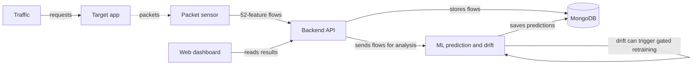
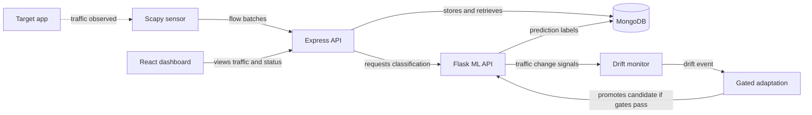

# Architecture Diagram

CyberAdapt observes traffic to a target, classifies its network flows, checks for traffic-pattern changes, and displays results. The diagrams focus on the main system path; supporting details are summarized below.

## Application Architecture

<!-- mermaid-checked: no \n, no em-dash/en-dash, no {} in labels, subgraphs are id["label"], arrows are -->|"label"|, all subgraphs closed by end, ids unique -->

### Technology Stack Summary

| Layer | Technology | Version | Purpose |
|---|---|---|---|
| Dashboard | React, Vite, Tailwind CSS | React 18, Vite 6, Tailwind 3 | Displays traffic and model status |
| Backend | Node.js, Express, Mongoose | Node 22 container, Express 4, Mongoose 8 | Accepts telemetry and serves dashboard API |
| Sensor | Python, Scapy | Python version not pinned in inspected configuration | Captures packets and creates 52-feature flows |
| ML service | Python, Flask, scikit-learn, LightGBM, River | Minimums declared in `ml/requirements.txt` | Predicts threats, monitors drift, and evaluates candidate models |
| Storage | MongoDB | 7 | Stores network flows and predictions |
| Local lab | Docker Compose | Compose configuration | Runs the services together |

### Data Storage & External Services

MongoDB stores flow records and their predictions. Model and drift state are stored in a Docker volume. The local lab uses OWASP Juice Shop as its target application.

### Key Architectural Decisions

- The backend stores incoming flows before requesting ML predictions asynchronously.
- Drift means traffic patterns changed; it does not by itself prove an attack.
- Retraining uses eligible labeled evidence, and a candidate model must pass evaluation gates before promotion.

## Component Relationships

<!-- mermaid-checked: no \n, no em-dash/en-dash, no {} in labels, subgraphs are id["label"], arrows are -->|"label"|, all subgraphs closed by end, ids unique -->

### Component Inventory

| Component | Layer | Type | Responsibility |
|---|---|---|---|
| Target app | Traffic source | Web application | Receives traffic observed by the sensor |
| Scapy sensor | Capture | Edge process | Converts captured packets into 52-feature flows |
| Express API | Backend | REST API | Authenticates sensors, accepts flow batches, stores them, and requests classification |
| MongoDB | Storage | Database | Keeps flows and their prediction results |
| Flask ML API | ML | Inference API | Applies feature mapping and returns threat predictions |
| Drift monitor | ML | Streaming monitor | Watches prediction ratios and selected feature distributions for changes |
| Gated adaptation | ML | Model adaptation | Trains a candidate from eligible labeled evidence and promotes it only when evaluation gates pass |
| React dashboard | UI | Web application | Shows traffic, predictions, drift, and adaptation status |
